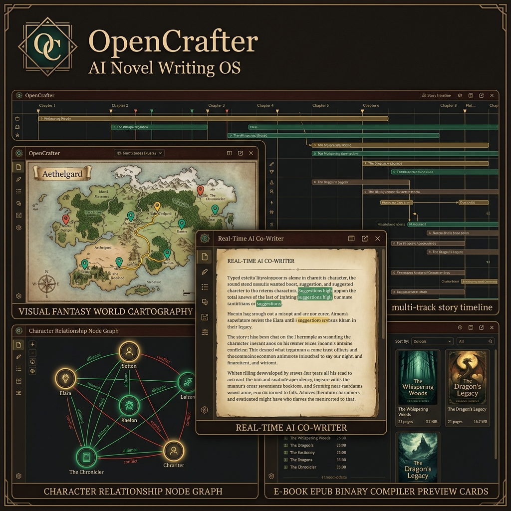

# 📖 OpenCrafter Studio



**The privacy-first, self-hosted AI novel writing OS & story architecture studio.**

[License: MIT](https://github.com/epb5030/NovelCrafter_OS_Alt/blob/main/LICENSE) | [CI: Passing](https://github.com/epb5030/NovelCrafter_OS_Alt/actions) | [Node.js v20.x](https://nodejs.org) | [Ollama / Gemini / OpenAI / Anthropic](https://ollama.com)

---

## ⚡ One-Line Quickstart

Clone, install, build, and launch OpenCrafter in a single command:

```bash
git clone https://github.com/epb5030/NovelCrafter_OS_Alt.git && cd NovelCrafter_OS_Alt && npm --prefix backend install && npm --prefix frontend install && npm --prefix frontend run build && npm --prefix backend run build && node backend/dist/index.js
```

👉 **Access Live Studio**: Open **`http://localhost:3005`** in your browser.

---

## 🔒 Security, Privacy & Runtime Defaults

> **⚠️ PRIVACY & DATABASE WARNING**:
> The SQLite database file (**`backend/data/novels.db`**) stores your project manuscript prose, codex lore entries, plot matrix items, and configured studio settings.
> **NEVER commit `backend/data/` or `*.db` to git repositories or push them to public GitHub repos.**

### Key Management Best Practices

- **Environment Variable Priority**: Set API keys (`OPENAI_API_KEY`, `ANTHROPIC_API_KEY`, `GEMINI_API_KEY`, `OPENROUTER_API_KEY`, `OLLAMA_CLOUD_API_KEY`) in `.env` to override SQLite settings.
- **Server-Side AES-256-GCM Encryption**: API keys saved via the UI are encrypted server-side with AES-256-GCM before writing to disk.
- **1-Click Stored Key Wiping**: Strip all API keys from SQLite at any time via **"🧹 Clear All Stored Keys"** in Studio Settings.

---

## 📋 Prerequisites

- **Node.js**: v18.x or v20.x+
- **npm**: v9.x+
- **(Optional) Local AI**: [Ollama](https://ollama.com) running locally for 100% offline private writing.

---

## ✨ Key Features

### 🤖 Multi-Provider AI Co-Writer Engine

- **Real-Time SSE Streaming**: Seamless prose continuation, beat expansion, and line rewrites.
- **Provider Support**: Ollama (local offline), Ollama Cloud & Remote GPU Host, Google Gemini (1M+ context streaming), OpenAI (GPT-4o), Anthropic Claude 3.5, and OpenRouter.
- **Style Presets**: Configure Point of View (First Person, Third Limited, Omniscient), Tense (Past, Present), Tone, and Custom Author Guidelines.

### 📖 Story Codex & Lore Network Graph

- Inline `@` mentions with instant lore cards for characters, locations, items, and magic systems.
- Visual 2D force-directed relationship graph with interactive node dragging and connection inspector.

### 📊 2D Character Arc & Plot Beat Matrix

- Interactive grid mapping characters and subplots across chapters.
- Visual POV screen-time distribution bar charts and dramatic tension pacing wave curves.
- Manuscript auto-scanner to track character roles (Absent, Mentioned, Present, POV) per scene.

### ⏱️ Multi-Track Story Timeline & Chronology Engine

- 4 parallel chronology tracks: *Main Story Arc*, *Character Backstories & Lifelines*, *World Lore & Historical Eras*, and *Subplots*.
- Filter by track, assign importance badges (*Climax, Turning Point*), and auto-generate timeline events directly from manuscript outline scenes.

### 🗺️ World Cartography & Interactive Story Map

- Cartographic parchment canvas with drag-and-drop location pins (*Cities, Fortresses, Wilderness, Landmarks, Dungeons, Portals*).
- Trace color-coded character journey paths across chapters.
- Spatial travel calculator (on foot, horseback, carriage, sailing ship, flight, portal) estimating distance in miles/leagues and duration in days.

### 🎤 AI Character Voice Tuner & Dialogue Doctor

- Configure Codex speech personas: explicit voice traits, catchphrases, formality register (1-5), and speech cadence (*Punchy, Eloquent, Rambling, Cryptic*).
- Extract spoken dialogue across manuscript chapters with speaker attribution.
- Calculate **Global Voice Distinctiveness Score** and contraction usage ratios.
- 1-Click AI dialogue line tuner to enforce authentic character voice.

### 📦 Native EPUB 3 & Word DOCX Binary Book Compiler

- **EPUB 3 E-Books**: Generates valid `.epub` packages with custom cover art, dynamic Table of Contents, and typography themes (*Classic Garamond, Modern Sans, Vintage Typewriter*).
- **Microsoft Word (.docx)**: Compiles industry-standard Shunn literary submission format (double spaced, 1-inch margins, Times New Roman, author title page) and clean reading drafts.

---

## 🐳 Docker Deployment

Run OpenCrafter using Docker Compose:

```bash
docker-compose up -d --build
```

Access the application at `http://localhost:3005`.

---

## 📚 Community, Governance & Documentation

- **🚀 First-Time Author Guide**: See [`docs/FIRST-TIME-USER-GUIDE.md`](docs/FIRST-TIME-USER-GUIDE.md).
- **📖 Technical Architecture**: See [`docs/Architecture.md`](docs/Architecture.md).
- **🔌 REST API Reference**: See [`docs/API-Reference.md`](docs/API-Reference.md).
- **📝 Changelog & Version History**: See [`CHANGELOG.md`](CHANGELOG.md).
- **🤝 Contribution Guidelines**: See [`CONTRIBUTING.md`](CONTRIBUTING.md).
- **🛡️ Code of Conduct**: See [`CODE_OF_CONDUCT.md`](CODE_OF_CONDUCT.md).
- **👥 Authors & Maintainers**: See [`AUTHORS.md`](AUTHORS.md) and [`MAINTAINERS.md`](MAINTAINERS.md).

---

## 🏷️ Repository Topics

`ai-writing` • `novel-writing` • `storytelling` • `worldbuilding` • `ollama` • `gemini` • `openai` • `anthropic` • `react` • `typescript` • `epub-compiler` • `docx-compiler` • `cartography` • `character-arcs` • `self-hosted`

---

## 📜 License

Distributed under the **MIT License**. See [`LICENSE`](LICENSE) for details.
